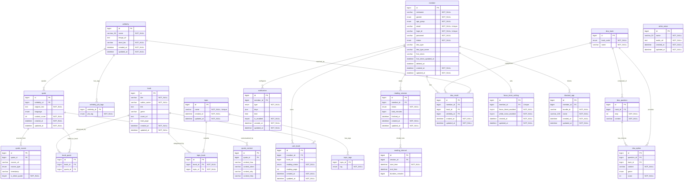

# WhoReads ERD

> ERD Cloud: https://www.erdcloud.com/d/vymgaEnwdvs8Pf2HL

```mermaid
erDiagram
    member ||--o{ user_book : "owns"
    book ||--o{ user_book : "added_to"
    celebrity ||--o{ celebrity_job_tags : "has_tags"
    celebrity ||--o{ quote : "speaks"
    book ||--o{ book_quote : "referenced_by"
    quote ||--o{ book_quote : "linked_to_book"
    quote ||--o{ quote_context : "contextualized_by"
    quote ||--o{ quote_source : "sourced_from"
    book ||--o{ topic_book : "categorized_by"
    topic ||--o{ topic_book : "contains"
    topic ||--o{ topic_tags : "has_tags"
    member ||--o{ notification : "configures"
    member ||--o{ reading_session : "starts"
    reading_session ||--o{ reading_interval : "divided_into"
    dna_track ||--o{ dna_question : "composed_of"
    dna_question ||--o{ dna_option : "has_choices"
    dna_track ||--o{ dna_option : "provides"
    member ||--o{ dna_result : "has"
    dna_track ||--o{ dna_result : "categorizes"
    celebrity ||--o{ dna_result : "matched_as"
    member ||--o{ focus_timer_setting : "sets"
    member ||--o{ blocked_app : "blocks"

    member {
        bigint id PK
        varchar nickname "NOT_NULL"
        enum gender "NOT_NULL"
        enum age_group "NOT_NULL"
        varchar email "NOT_NULL, Unique"
        varchar login_id "NOT_NULL, Unique"
        varchar password "NOT_NULL"
        enum status "NOT_NULL"
        varchar dna_type
        varchar dna_type_name
        varchar fcm_token
        datetime fcm_token_updated_at
        datetime deleted_at
        datetime created_at "NOT_NULL"
        datetime updated_at "NOT_NULL"
    }

    book {
        bigint id PK
        varchar title "NOT_NULL"
        varchar author_name "NOT_NULL"
        text link
        varchar genre
        text cover_url
        int total_page
        datetime created_at "NOT_NULL"
        datetime updated_at "NOT_NULL"
    }

    user_book {
        bigint id PK
        bigint member_id FK
        bigint book_id FK
        enum reading_status "NOT_NULL"
        int reading_page
        datetime created_at "NOT_NULL"
        datetime updated_at "NOT_NULL"
    }

    celebrity {
        bigint id PK
        varchar_50 name "NOT_NULL"
        text image_url
        varchar short_bio "NOT_NULL"
        datetime created_at "NOT_NULL"
        datetime updated_at "NOT_NULL"
    }

    celebrity_job_tags {
        bigint celebrity_id FK
        enum job_tag "NOT_NULL"
    }

    quote {
        bigint id PK
        bigint celebrity_id FK
        text original_text "NOT_NULL"
        enum language
        int context_score "NOT_NULL"
        datetime created_at "NOT_NULL"
        datetime updated_at "NOT_NULL"
    }

    book_quote {
        bigint id PK
        bigint book_id FK
        bigint quote_id FK
    }

    quote_context {
        bigint id PK
        bigint quote_id FK
        varchar context_how
        varchar context_when
        varchar context_why
        varchar context_help
    }

    quote_source {
        bigint id PK
        bigint quote_id FK
        varchar source_url
        enum source_type
        varchar timestamp
        tinyint is_direct_quote "NOT_NULL"
    }

    topic {
        bigint id PK
        varchar name "NOT_NULL, Unique"
        datetime created_at "NOT_NULL"
        datetime updated_at "NOT_NULL"
    }

    topic_tags {
        bigint topic_id FK
        enum tag "NOT_NULL"
    }

    topic_book {
        bigint id PK
        bigint book_id FK "NOT_NULL"
        bigint topic_id FK "NOT_NULL"
    }

    notification {
        bigint id PK
        bigint member_id FK
        enum type "NOT_NULL"
        json days
        time time
        tinyint is_enabled "NOT_NULL"
        datetime created_at "NOT_NULL"
        datetime updated_at "NOT_NULL"
    }

    reading_session {
        bigint id PK
        bigint member_id FK
        enum status "NOT_NULL"
        bigint total_minutes
        datetime finished_at
        datetime created_at "NOT_NULL"
        datetime updated_at "NOT_NULL"
    }

    reading_interval {
        bigint id PK
        bigint session_id FK
        datetime start_time "NOT_NULL"
        datetime end_time
        bigint duration_minutes
    }

    dna_track {
        bigint id PK
        enum track_code "NOT_NULL"
        varchar name "NOT_NULL"
    }

    dna_question {
        bigint id PK
        bigint track_id FK
        int step "NOT_NULL"
        varchar content "NOT_NULL"
    }

    dna_option {
        bigint id PK
        bigint question_id FK
        bigint track_id FK
        varchar content "NOT_NULL"
        enum genre
        int score "NOT_NULL"
    }

    dna_result {
        bigint id PK
        bigint member_id FK
        bigint track_id FK
        bigint celebrity_id FK
        datetime created_at "NOT_NULL"
        datetime updated_at "NOT_NULL"
    }

    focus_timer_setting {
        bigint id PK
        bigint member_id FK "Unique"
        tinyint focus_block_enabled "NOT_NULL"
        tinyint white_noise_enabled "NOT_NULL"
        datetime created_at "NOT_NULL"
        datetime updated_at "NOT_NULL"
    }

    white_noise {
        bigint id PK
        varchar_50 name "NOT_NULL"
        text audio_url "NOT_NULL"
        datetime created_at "NOT_NULL"
        datetime updated_at "NOT_NULL"
    }

    blocked_app {
        bigint id PK
        bigint member_id FK
        varchar bundle_id "NOT_NULL"
        varchar_100 name "NOT_NULL"
        datetime created_at "NOT_NULL"
        datetime updated_at "NOT_NULL"
    }

```
